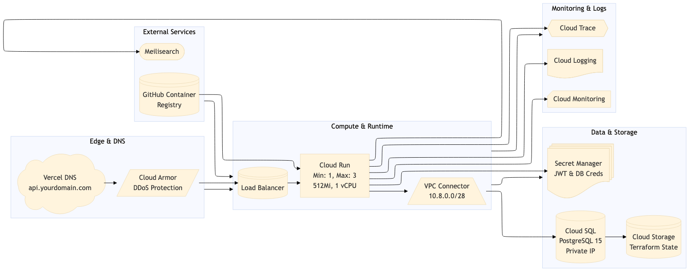
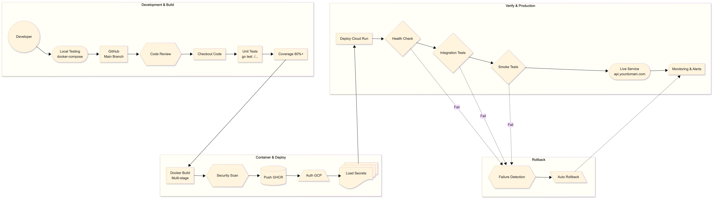

# Architectural Overview

High-level diagrams based on the current architecture with source code available at `/assets/*.mmd` files.

## Cloud Architecture Diagram
Basic setup with a running container deployed to Cloud Run + Cloud SQL PostgreSQL instance.

## CI/CD Pipelines Diagram
Pipelines are powered by GitHub Actions with specs found at `.github/workflows/*.yml` files.

