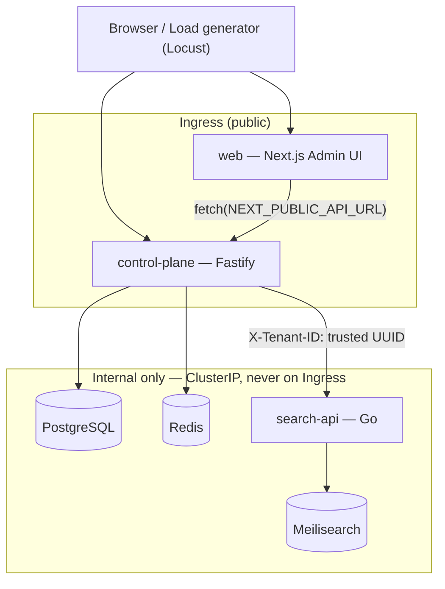

# Architecture

This document describes the **current, implemented** architecture of the
multi-tenant search SaaS platform. The frozen cross-team interface it
implements lives in [`CONTRACT.md`](CONTRACT.md); this file explains how the
pieces fit together and why.

> Historical note: `docs/ARCHITECTURE_DIAGRAMS.md`, `docs/SWAGGER_UI_GUIDE.md`
> and `docs/swagger.yaml` describe an earlier, single-service iteration of
> this project (a standalone "Fashion Catalog API" on Cloud Run with no
> tenancy, control plane, or Kubernetes runtime). They are retained for
> history but are **superseded** by this document, `README.md`, and
> `CONTRACT.md` for the current submission.

## 1. Component topology


```mermaid
flowchart TB
    Browser["Browser / Load generator (Locust)"]

    subgraph Ingress["Ingress (public)"]
        direction LR
        Web["web — Next.js Admin UI"]
        CP["control-plane — Fastify"]
    end

    subgraph Internal["Internal only — ClusterIP, never on Ingress"]
        direction LR
        PG[("PostgreSQL")]
        Redis[("Redis")]
        Search["search-api — Go"]
        Meili[("Meilisearch")]
    end

    Browser --> Web
    Browser --> CP
    Web -->|"fetch(NEXT_PUBLIC_API_URL)"| CP
    CP --> PG
    CP --> Redis
    CP -->|"X-Tenant-ID: trusted UUID"| Search
    Search --> Meili
```

- **Public** (reachable through the Ingress / host ports): `web` (Next.js
  Admin UI) and `control-plane` (Fastify). These are the only two components
  an external client can address directly.
- **Internal only** (ClusterIP in k8s, no host port in Docker Compose):
  `search-api` (Go), `postgres`, `redis`, `meilisearch`. The Go search
  service in particular is **never** exposed publicly — see §3.

## 2. Component responsibilities

| Component | Tech | Responsibility |
|---|---|---|
| `web` (`apps/web/**`) | Next.js 14 (App Router), React | Admin UI: signup/login, organization create/select, plan badge, catalog seeding, search box + results, usage counters. Talks only to the public control-plane API. |
| `control-plane` (`apps/control-plane/**`) | Fastify, Prisma, TypeScript | The **only** component that owns identity, membership, plan, and quota state. Authenticates users (JWT via `@fastify/jwt`), resolves org membership/role, enforces RBAC, applies per-organization Redis rate limits, records usage events, and proxies tenant-scoped search/index calls to the Go service with a **trusted, server-derived** `X-Tenant-ID`. |
| `search-api` (`cmd/**`, `internal/**`, `pkg/**`) | Go, Gin, Meilisearch client | Stateless multi-tenant search/index engine. Trusts the `X-Tenant-ID` header set by control-plane, and only that header, to pick which Meilisearch index to hit. Has no concept of users, orgs, plans, or auth beyond that header. |
| `postgres` | PostgreSQL 16 | System of record for `User`, `Organization`, `Membership`, `UsageEvent` (Prisma-managed, see §5). |
| `redis` | Redis 7 | Org-scoped, fixed-window rate-limit counters (`rate:{organizationId}:search:{window}`), consumed only by control-plane. Not durable state — losing it just resets counters. |
| `meilisearch` | Meilisearch v1.13 | Full-text search engine. One index per tenant (§4), never shared across tenants. |

## 3. Trust boundary (tenant isolation)

This is the non-negotiable rule the whole system is built around: **external
clients never choose the tenant identifier used by the Go service.**

Every tenant-scoped request goes through this pipeline in control-plane
(`apps/control-plane/src/routes/organizations.ts`):

```
authenticate user (JWT)
  -> resolve :slug -> Organization (Prisma)
  -> verify caller is a member (lib/membership.ts: resolveMembership)
  -> authorize by role where required (requireRole: OWNER/ADMIN for
     plan changes and document indexing)
  -> load plan (FREE/PRO) -> apply Redis quota (lib/redis.ts)
  -> call search-api with X-Tenant-ID = organization.id (a UUID control-plane
     looked up itself, never taken from the request)
```

Any external `X-Tenant-ID` header sent by a client is **irrelevant**:
control-plane never reads an inbound `X-Tenant-ID` from the caller at all —
the header it sends downstream is always the UUID it resolved server-side
from `:slug` + the membership check. `tests/e2e/tenant-isolation-and-quota.spec.ts`
exercises this directly: it forges an `X-Tenant-ID` pointing at tenant A
while calling tenant B's slug and asserts zero cross-tenant leakage.

On the Go side (`internal/handlers/internal_search.go`), `requireTenantID`
rejects any request with a missing or empty `X-Tenant-ID` with `400`. The Go
service has no independent way to authenticate a tenant — it fully trusts
whatever calls it on its internal-only network path, which is why it must
never be exposed publicly (§1, §4, and `CONTRACT.md` §1/§9 all state this;
the k8s Ingress manifests literally do not route to it).

## 4. Per-tenant index isolation

Each organization gets its own Meilisearch index:

```
tenant_<normalized-org-uuid>_articles
```

where the UUID is lowercased and `-` is replaced with `_`. Index
searchable/filterable/sortable configuration is lazily initialized the first
time a tenant is indexed into (`internal/search/engine.go` /
`internal/adapters/meilisearch.go`). Because the index name is derived from
the trusted server-side UUID (§3), there is no code path by which one
tenant's query can be evaluated against another tenant's index.

## 5. Data model (PostgreSQL, owned by control-plane / Prisma)

```
User(id, email UNIQUE, passwordHash, name, createdAt)
Organization(id UUID, name, slug UNIQUE, plan FREE|PRO, createdAt)
Membership(id, userId, organizationId, role OWNER|ADMIN|MEMBER)
UsageEvent(id, organizationId, userId?, operation SEARCH|INDEX, statusCode, createdAt)
```

`Membership` is the join table that both grants access to an org and carries
the RBAC role. `UsageEvent` is written on every search/index attempt
(success and failure, including `429`s) and is what powers the
`GET /organizations/:slug/usage` endpoint and the Admin UI's usage counters.
Schema source: `apps/control-plane/prisma/schema.prisma`; migrations under
`apps/control-plane/prisma/migrations/`.

## 6. RBAC and plans

Roles (`OWNER`, `ADMIN`, `MEMBER`) are per-membership, not global. Enforcement
(`apps/control-plane/src/lib/membership.ts`):

| Action | Required role |
|---|---|
| List/view an org's own data, search, view usage | any member |
| `PATCH /organizations/:slug/plan` | `OWNER` or `ADMIN` |
| `POST /organizations/:slug/documents/batch` | `OWNER` or `ADMIN` |
| Create an organization | any authenticated user (creator becomes `OWNER`) |

Plans are `FREE` and `PRO`, each with its own search rate limit
(`FREE_SEARCH_LIMIT` / `PRO_SEARCH_LIMIT`, defaults `30`/`300` requests per
minute, organization-scoped in Redis — see `CONTRACT.md` §6). There is no
hard feature gate beyond quota today; the plan controls throughput, not
endpoint availability.

Note: the Go service also has its own, older, **per-IP** in-memory rate
limiter (`internal/middleware/ratelimit.go`, configured by
`SEARCH_RATE_LIMIT`), a holdover from before the control-plane existed. It
still runs on the Go service's legacy public-style routes, but since those
routes are never exposed through the Ingress in the k8s deployment, the
control-plane's per-organization Redis limiter is the one that actually
governs traffic in this submission.

## 7. Public API surface

The full request/response contract is in `CONTRACT.md` §3. Summary:

| Method | Path | Auth | Notes |
|---|---|---|---|
| POST | `/auth/register` | none | email must match `ALLOWED_SIGNUP_EMAILS` |
| POST | `/auth/login` | none | returns JWT |
| GET | `/me` | Bearer | current user |
| GET | `/organizations` | Bearer | orgs the user belongs to |
| POST | `/organizations` | Bearer | creator becomes OWNER, plan defaults FREE |
| PATCH | `/organizations/:slug/plan` | OWNER/ADMIN | `{ "plan": "FREE" \| "PRO" }` |
| GET | `/organizations/:slug/usage` | member | search count + rate-limit rejections + index count |
| GET | `/organizations/:slug/search?q=...` | member | rate limited, proxied to Go with trusted `X-Tenant-ID` |
| POST | `/organizations/:slug/documents/batch` | OWNER/ADMIN | tenant injected, proxied to Go |

## 8. Deployment topologies

Three deployment surfaces exist in this repo, at three different levels of
maturity — see `README.md` and `docs/SUBMISSION_RUNBOOK.md` for details:

1. **Docker Compose** (`docker-compose.yml`) — the everyday local dev loop.
   Fully working end to end.
2. **Local Kubernetes on k3d** (`infra/k8s/**`, `infra/README.md`) — the
   actual acceptance target for this submission. Kustomize `base` +
   `overlays/local`. Verified by bringing up a real k3d cluster.
3. **GKE** (`infra/k8s/overlays/gke/**`) — manifests exist (image
   placeholders, GKE-appropriate Ingress patch, comments on Secret Manager
   migration) but **have not been applied to any real GKE cluster** for this
   submission. Treat this overlay as a documented intent, not a verified
   deployment.

There is also a legacy `Dockerfile` (repo root) + `.github/workflows/deploy-gcp.yml`
that predate the multi-tenant platform: they build and deploy only the Go
service as a standalone Cloud Run app (no control-plane, no web, no
tenancy). That pipeline is not part of this submission's deployment story —
it is left in place from the project's earlier phase and documented here so
it isn't mistaken for the current deployment path.

## 9. CI/CD

| Workflow | Scope | Blocking? |
|---|---|---|
| `build-and-test.yml` | Go build/test/`govulncheck` for the whole module | Yes |
| `control-plane-ci.yml` | `apps/control-plane/**` — type-check, build, `vitest` | Yes |
| `web-ci.yml` | `apps/web/**` — lint, `next build` | Yes |
| `acceptance-e2e.yml` | Playwright system tests (`tests/e2e/**`) | **No — `continue-on-error: true`, informational only** |
| `main.yml` (`AI Code Review`) | Legacy third-party PR review action from the project's earlier phase | Not part of this submission's gating |
| `deploy-gcp.yml` | Legacy standalone Cloud Run deploy of the Go service only | Not part of this submission's deployment story (see §8) |

The acceptance suite (`acceptance-e2e.yml`) is deliberately non-blocking: it
was authored before the platform existed (see its own header comment) and
is meant to go green once the full stack is deployed, not to gate ordinary
feature PRs.
