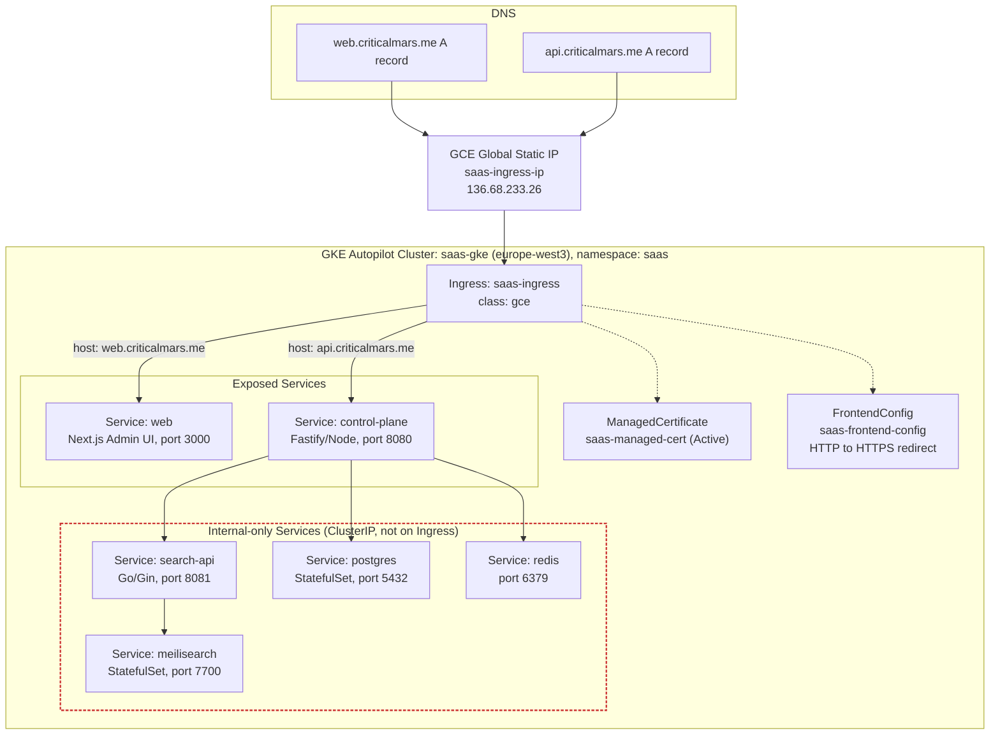
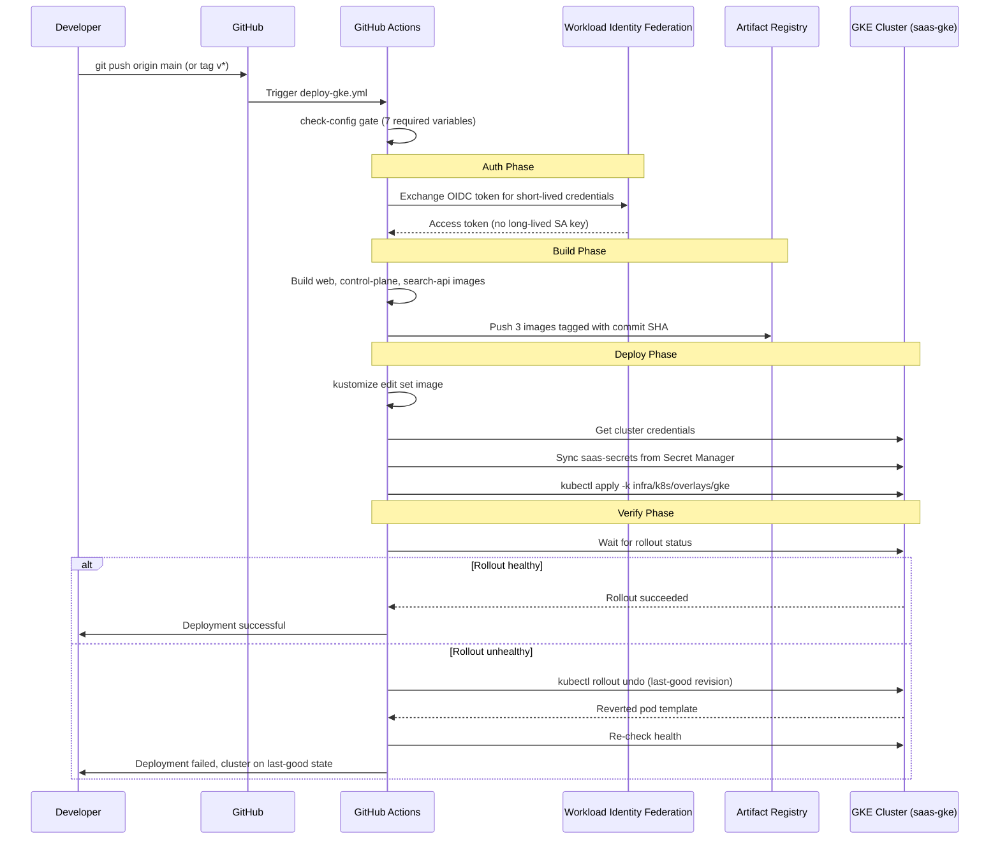
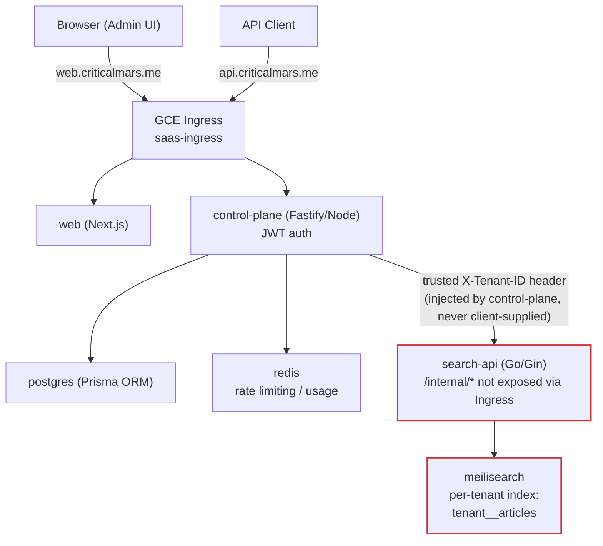
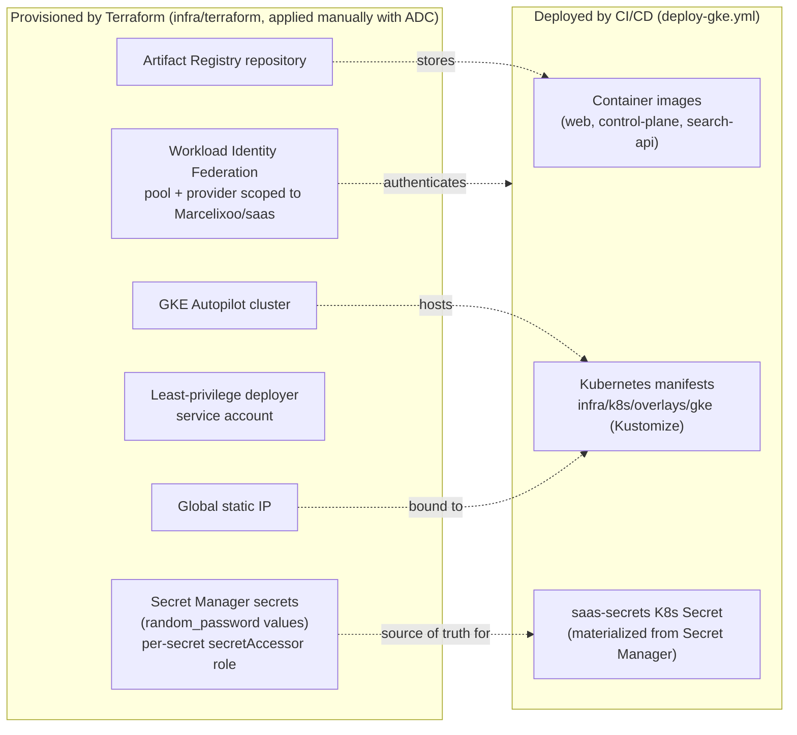
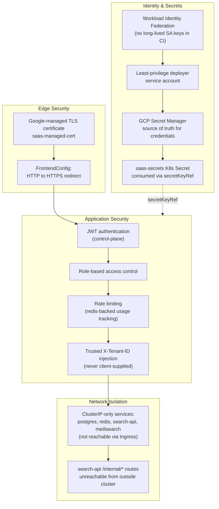

# Multi-Tenant Search SaaS Platform - Architecture Diagrams

## 1. GKE Runtime Architecture


```mermaid
flowchart TB
    subgraph DNS["DNS"]
        WebDNS["web.criticalmars.me A record"]
        ApiDNS["api.criticalmars.me A record"]
    end

    StaticIP["GCE Global Static IP<br/>saas-ingress-ip<br/>136.68.233.26"]

    subgraph GKE["GKE Autopilot Cluster: saas-gke (europe-west3), namespace: saas"]
        Ingress["Ingress: saas-ingress<br/>class: gce"]
        Cert["ManagedCertificate<br/>saas-managed-cert (Active)"]
        Frontend["FrontendConfig<br/>saas-frontend-config<br/>HTTP to HTTPS redirect"]

        subgraph Exposed["Exposed Services"]
            WebSvc["Service: web<br/>Next.js Admin UI, port 3000"]
            CpSvc["Service: control-plane<br/>Fastify/Node, port 8080"]
        end

        subgraph Internal["Internal-only Services (ClusterIP, not on Ingress)"]
            SearchSvc["Service: search-api<br/>Go/Gin, port 8081"]
            PgSvc["Service: postgres<br/>StatefulSet, port 5432"]
            RedisSvc["Service: redis<br/>port 6379"]
            MsSvc["Service: meilisearch<br/>StatefulSet, port 7700"]
        end
    end

    WebDNS --> StaticIP
    ApiDNS --> StaticIP
    StaticIP --> Ingress
    Ingress -.-> Cert
    Ingress -.-> Frontend
    Ingress -->|host: web.criticalmars.me| WebSvc
    Ingress -->|host: api.criticalmars.me| CpSvc

    CpSvc --> PgSvc
    CpSvc --> RedisSvc
    CpSvc --> SearchSvc
    SearchSvc --> MsSvc

    classDef boundary stroke:#cc3333,stroke-width:2px,stroke-dasharray: 4 2;
    class Internal boundary
```

Trust boundary: only `web` and `control-plane` are reachable through the Ingress. `search-api`, `postgres`, `redis`, and `meilisearch` are internal `ClusterIP` services with no external route.

## 2. CI/CD Pipeline (deploy-gke.yml)


```mermaid
flowchart LR
    Trigger["Trigger:<br/>push to main, tag v*,<br/>or workflow_dispatch"]
    Gate{"check-config gate<br/>all 7 repo variables set?"}
    Skip["Deploy skipped"]

    Checkout["Checkout code"]
    WIF["Authenticate via<br/>Workload Identity Federation"]
    BuildWeb["Build & push web image"]
    BuildCp["Build & push control-plane image"]
    BuildSearch["Build & push search-api image"]
    AR["Google Artifact Registry<br/>europe-west3-docker.pkg.dev/criticalmars-saas-505914/saas<br/>tagged with commit SHA"]
    Kustomize["kustomize edit set image"]
    Creds["Get GKE credentials"]
    SecretSync["Sync saas-secrets from<br/>GCP Secret Manager"]
    Apply["kubectl apply -k<br/>infra/k8s/overlays/gke"]
    Rollout{"Wait for rollout<br/>healthy?"}
    Success["Deployment complete"]
    Rollback["kubectl rollout undo<br/>to last-good revision"]
    RecheckHealth["Re-check health"]
    Fail["Build marked failed<br/>cluster left on last-good state"]

    Trigger --> Gate
    Gate -->|missing variables| Skip
    Gate -->|ok| Checkout
    Checkout --> WIF
    WIF --> BuildWeb --> AR
    WIF --> BuildCp --> AR
    WIF --> BuildSearch --> AR
    AR --> Kustomize
    Kustomize --> Creds
    Creds --> SecretSync
    SecretSync --> Apply
    Apply --> Rollout
    Rollout -->|yes| Success
    Rollout -->|no| Rollback
    Rollback --> RecheckHealth
    RecheckHealth --> Fail
```

Note: `rollout undo` reverts only the pod template, not ConfigMaps or Secrets, and forward database migrations are not reverted.

## 3. Deploy Sequence Diagram


```mermaid
sequenceDiagram
    participant Dev as Developer
    participant GH as GitHub
    participant GA as GitHub Actions
    participant WIF as Workload Identity Federation
    participant AR as Artifact Registry
    participant GKE as GKE Cluster (saas-gke)

    Dev->>GH: git push origin main (or tag v*)
    GH->>GA: Trigger deploy-gke.yml

    GA->>GA: check-config gate (7 required variables)

    Note over GA,WIF: Auth Phase
    GA->>WIF: Exchange OIDC token for short-lived credentials
    WIF-->>GA: Access token (no long-lived SA key)

    Note over GA,AR: Build Phase
    GA->>GA: Build web, control-plane, search-api images
    GA->>AR: Push 3 images tagged with commit SHA

    Note over GA,GKE: Deploy Phase
    GA->>GA: kustomize edit set image
    GA->>GKE: Get cluster credentials
    GA->>GKE: Sync saas-secrets from Secret Manager
    GA->>GKE: kubectl apply -k infra/k8s/overlays/gke

    Note over GA,GKE: Verify Phase
    GA->>GKE: Wait for rollout status

    alt Rollout healthy
        GKE-->>GA: Rollout succeeded
        GA->>Dev: Deployment successful
    else Rollout unhealthy
        GA->>GKE: kubectl rollout undo (last-good revision)
        GKE-->>GA: Reverted pod template
        GA->>GKE: Re-check health
        GA->>Dev: Deployment failed, cluster on last-good state
    end
```

## 4. Request / Data Flow (Multi-Tenant)


```mermaid
flowchart TD
    Browser["Browser (Admin UI)"]
    ApiClient["API Client"]

    Ingress["GCE Ingress<br/>saas-ingress"]

    Web["web (Next.js)"]
    CP["control-plane (Fastify/Node)<br/>JWT auth"]

    Postgres["postgres (Prisma ORM)"]
    Redis["redis<br/>rate limiting / usage"]
    SearchApi["search-api (Go/Gin)<br/>/internal/* not exposed via Ingress"]
    Meili["meilisearch<br/>per-tenant index:<br/>tenant_<normalized-uuid>_articles"]

    Browser -->|web.criticalmars.me| Ingress
    ApiClient -->|api.criticalmars.me| Ingress
    Ingress --> Web
    Ingress --> CP

    CP --> Postgres
    CP --> Redis
    CP -->|"trusted X-Tenant-ID header<br/>(injected by control-plane, never client-supplied)"| SearchApi
    SearchApi --> Meili

    classDef trust stroke:#cc3333,stroke-width:2px;
    class SearchApi,Meili trust
```

The tenant id is never chosen by an external client. `control-plane` authenticates the caller via JWT and injects a trusted `X-Tenant-ID` header on every internal call to `search-api`, which in turn scopes each request to that tenant's own Meilisearch index.

## 5. Infrastructure / IaC Map


```mermaid
flowchart LR
    subgraph Terraform["Provisioned by Terraform (infra/terraform, applied manually with ADC)"]
        TfCluster["GKE Autopilot cluster"]
        TfAR["Artifact Registry repository"]
        TfWIF["Workload Identity Federation<br/>pool + provider scoped to Marcelixoo/saas"]
        TfSA["Least-privilege deployer<br/>service account"]
        TfIP["Global static IP"]
        TfSecrets["Secret Manager secrets<br/>(random_password values)<br/>per-secret secretAccessor role"]
    end

    subgraph CD["Deployed by CI/CD (deploy-gke.yml)"]
        CdImages["Container images<br/>(web, control-plane, search-api)"]
        CdManifests["Kubernetes manifests<br/>infra/k8s/overlays/gke (Kustomize)"]
        CdSecretSync["saas-secrets K8s Secret<br/>(materialized from Secret Manager)"]
    end

    TfCluster -.->|hosts| CdManifests
    TfAR -.->|stores| CdImages
    TfWIF -.->|authenticates| CD
    TfSecrets -.->|source of truth for| CdSecretSync
    TfIP -.->|bound to| CdManifests
```

Terraform state is local and git-ignored; it is applied manually, not via the deploy pipeline. Local development uses docker-compose / k3d with the `infra/k8s/overlays/local` Kustomize overlay.

## 6. Security Architecture


```mermaid
flowchart TD
    subgraph EdgeSecurity["Edge Security"]
        TLS["Google-managed TLS certificate<br/>saas-managed-cert"]
        Redirect["FrontendConfig:<br/>HTTP to HTTPS redirect"]
    end

    subgraph AppSecurity["Application Security"]
        JWT["JWT authentication<br/>(control-plane)"]
        RBAC["Role-based access control"]
        RateLimit["Rate limiting<br/>(redis-backed usage tracking)"]
        TenantHeader["Trusted X-Tenant-ID injection<br/>(never client-supplied)"]
    end

    subgraph NetworkSecurity["Network Isolation"]
        ClusterIP["ClusterIP-only services:<br/>postgres, redis, search-api, meilisearch<br/>(not reachable via Ingress)"]
        InternalRoutes["search-api /internal/* routes<br/>unreachable from outside cluster"]
    end

    subgraph IdentitySecurity["Identity & Secrets"]
        WIFSec["Workload Identity Federation<br/>(no long-lived SA keys in CI)"]
        LeastPriv["Least-privilege deployer<br/>service account"]
        SecretMgr["GCP Secret Manager<br/>source of truth for credentials"]
        K8sSecret["saas-secrets K8s Secret<br/>consumed via secretKeyRef"]
    end

    TLS --> Redirect
    Redirect --> JWT
    JWT --> RBAC
    RBAC --> RateLimit
    RateLimit --> TenantHeader
    TenantHeader --> ClusterIP
    ClusterIP --> InternalRoutes

    WIFSec --> LeastPriv
    LeastPriv --> SecretMgr
    SecretMgr --> K8sSecret
    K8sSecret -.->|secretKeyRef| AppSecurity
```

---

## Diagram Descriptions

### 1. GKE Runtime Architecture
- **Purpose**: Shows the live GKE Autopilot cluster topology, from DNS and the static IP through the Ingress to exposed and internal services.
- **Key Components**: `saas-ingress` (GCE class), Google-managed certificate, FrontendConfig redirect, `web` and `control-plane` Deployments, internal `postgres`/`redis`/`meilisearch`/`search-api`.
- **Highlights**: The trust boundary — only `web` and `control-plane` are Ingress-routed; everything else is `ClusterIP`-only.

### 2. CI/CD Pipeline
- **Purpose**: Illustrates `deploy-gke.yml`, the workflow that builds and deploys all three services to GKE.
- **Key Stages**: Config gate, WIF auth, multi-image build/push to Artifact Registry, manifest apply, rollout verification.
- **Highlights**: Automatic rollback via `kubectl rollout undo` on a failed rollout, leaving the cluster on its last-good state.

### 3. Deploy Sequence Diagram
- **Purpose**: Sequence diagram of a single deploy from push to rollout outcome.
- **Key Interactions**: GitHub Actions to Workload Identity Federation to Artifact Registry to GKE.
- **Highlights**: Short-lived WIF credentials (no service-account key), the success/failure branch, and auto-rollback.

### 4. Request / Data Flow
- **Purpose**: Shows how a request travels from a client to the internal data stores in a multi-tenant context.
- **Key Layers**: Ingress to `web`/`control-plane` to `postgres`/`redis`/`search-api` to `meilisearch`.
- **Highlights**: Trusted `X-Tenant-ID` header injection by `control-plane` and per-tenant Meilisearch indexes.

### 5. Infrastructure / IaC Map
- **Purpose**: Distinguishes what Terraform provisions (cluster, registry, WIF, static IP, secrets) from what the CI/CD pipeline deploys (images, manifests, synced secrets).
- **Key Aspects**: Terraform state is local and applied manually; CI/CD never touches infrastructure, only application deployment.

### 6. Security Architecture
- **Purpose**: Summarizes the layered security controls actually in place.
- **Key Controls**: Managed TLS certificate with HTTP-to-HTTPS redirect, JWT and RBAC, rate limiting, `ClusterIP` network isolation, Workload Identity Federation, least-privilege service account, Secret Manager as the credential source of truth.

---

## Viewing Instructions

These diagrams use **Mermaid** syntax and can be viewed:

1. **GitHub**: Automatically renders in README.md and markdown files
2. **VS Code**: Install "Markdown Preview Mermaid Support" extension
3. **Online**: Paste code into https://mermaid.live/
4. **Documentation Sites**: Works with GitBook, Docusaurus, MkDocs

## Export Options

To export as images:

```bash
# Install mermaid-cli
npm install -g @mermaid-js/mermaid-cli

# Convert to PNG
mmdc -i docs/ARCHITECTURE_DIAGRAMS.md -o architecture.png

# Convert to SVG
mmdc -i docs/ARCHITECTURE_DIAGRAMS.md -o architecture.svg
```

---

**Last Updated**: 2026-08-18
**Version**: 2.0.0
