# Fashion Catalog API - Architecture Diagrams

## 1. GCP Cloud Architecture Diagram


## 2. CI/CD Pipeline Diagram


## 3. Detailed CI/CD Pipeline Flow

```mermaid
sequenceDiagram
    participant Dev as Developer
    participant GH as GitHub
    participant GA as GitHub Actions
    participant GHCR as GitHub Container Registry
    participant GCP as Google Cloud Platform
    participant CR as Cloud Run
    participant SQL as Cloud SQL
    participant SM as Secret Manager

    Dev->>GH: git push origin main
    GH->>GA: Trigger workflow

    Note over GA: Build Phase
    GA->>GA: Checkout code
    GA->>GA: Setup Go 1.24
    GA->>GA: Run go test ./...
    GA->>GA: Check coverage > 80%

    Note over GA: Container Phase
    GA->>GA: Build Docker image
    GA->>GA: Security scan
    GA->>GHCR: Push image (latest, sha)

    Note over GA,GCP: Deploy Phase
    GA->>GCP: Authenticate with SA key
    GA->>SM: Fetch JWT_SECRET_KEY
    GA->>SM: Fetch DATABASE_URL

    GA->>CR: Deploy new revision
    CR->>GHCR: Pull Docker image
    CR->>SQL: Establish connection
    CR->>CR: Start container

    Note over GA,CR: Testing Phase
    GA->>CR: Health check GET /api
    CR-->>GA: 200 OK
    GA->>CR: Test GET /docs
    CR-->>GA: 200 OK

    Note over GA,CR: Traffic Management
    GA->>CR: Update traffic 100% to new
    CR->>CR: Gradual rollout

    alt Deployment Success
        GA->>Dev: ✅ Deployment successful
        CR->>GCP: Send metrics
    else Deployment Failure
        GA->>CR: Rollback to previous
        CR->>CR: Route to old revision
        GA->>Dev: ❌ Deployment failed
    end
```



## 4. Data Flow Diagram


## 5. Deployment Infrastructure Map


## 6. Security Architecture


---

## Diagram Descriptions

### 1. GCP Cloud Architecture
- **Purpose**: Shows the complete infrastructure layout on Google Cloud Platform
- **Key Components**: Cloud Run, Cloud SQL, VPC networking, Secret Manager
- **Highlights**: Private IP communication, multi-layer security, observability

### 2. CI/CD Pipeline
- **Purpose**: Illustrates the automated deployment flow from code to production
- **Key Stages**: Build, Test, Container, Deploy, Verify, Rollback
- **Highlights**: GitHub Actions automation, security scanning, health checks

### 3. Detailed Pipeline Flow
- **Purpose**: Sequence diagram showing interactions between components
- **Key Interactions**: GitHub → Actions → GCP → Cloud Run
- **Highlights**: Authentication flow, secret management, rollback strategy

### 4. Data Flow
- **Purpose**: Shows how data moves through the system layers
- **Key Layers**: Client → Edge → Application → Business → Data
- **Highlights**: Request routing, authentication, data access patterns

### 5. Deployment Infrastructure
- **Purpose**: Geographic distribution of resources
- **Key Aspects**: Multi-zone deployment, high availability, backup strategy
- **Highlights**: Auto-scaling, replication, disaster recovery

### 6. Security Architecture
- **Purpose**: Comprehensive security controls at each layer
- **Key Controls**: DDoS protection, JWT auth, encryption, audit logging
- **Highlights**: Defense in depth, compliance, monitoring

---

## Viewing Instructions

These diagrams use **Mermaid** syntax and can be viewed:

1. **GitHub**: Automatically renders in README.md and markdown files
2. **VS Code**: Install "Markdown Preview Mermaid Support" extension
3. **Online**: Paste code into https://mermaid.live/
4. **Documentation Sites**: Works with GitBook, Docusaurus, MkDocs

## Export Options

To export as images:

```bash
# Install mermaid-cli
npm install -g @mermaid-js/mermaid-cli

# Convert to PNG
mmdc -i docs/ARCHITECTURE_DIAGRAMS.md -o architecture.png

# Convert to SVG
mmdc -i docs/ARCHITECTURE_DIAGRAMS.md -o architecture.svg
```

---

**Last Updated**: 2025-01-24
**Version**: 1.0.0
